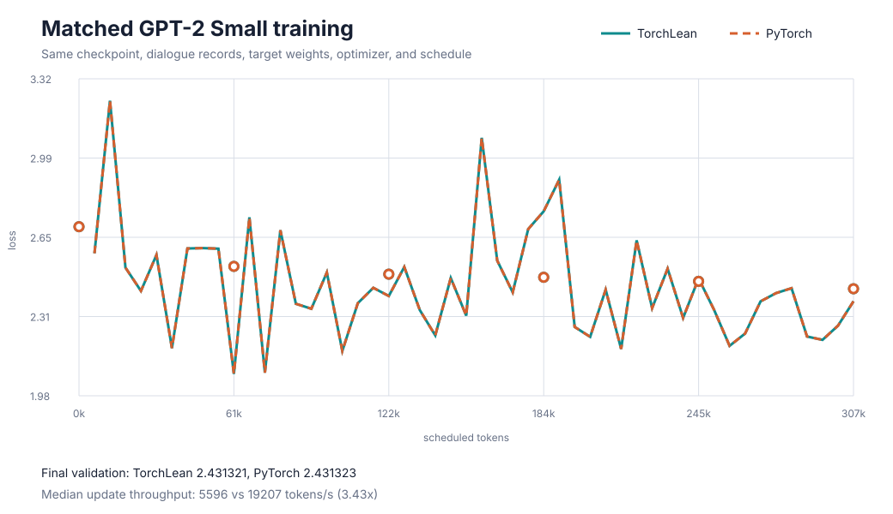

# Training GPT-2 Small in Lean

Andrej Karpathy's [`minGPT`](https://github.com/karpathy/minGPT) and
[`nanoGPT`](https://github.com/karpathy/nanoGPT) made the GPT training recipe unusually easy to
study: tokenize a corpus, train a decoder-only Transformer to predict the next token, and inspect
the continuations it learns. I wanted to know how much of that experiment could be carried out from
Lean without reducing it to a miniature demonstration.

I trained all 124,412,160 stored parameters of GPT-2 small in strict FP32 on one NVIDIA A100. The
first run processed one billion FineWeb-Edu tokens. I then resumed from its best saved checkpoint
and trained on another shard, bringing that parameter history to exactly 2,319,208,448 scheduled
tokens. Its best validation loss was 3.135083.

The base model learned. The attempt to turn it into an assistant did not go nearly as well. I ran
two rounds of assistant-masked instruction tuning, and both validation losses fell, but the final
checkpoint still gave confident wrong answers to elementary questions. That distinction matters:
the language-model training worked, while this small instruction-tuning recipe did not produce a
good chat model.

The model, training loop, checkpoint loader, cached decoder, and the theorem statements are all
written in Lean. A smaller Tiny Shakespeare preset runs the same program in a few minutes. The
companion essay, [*GPT-2 in Lean*](https://www.robertj1.com/ai4science/training-gpt2-in-lean/), tells
the story of the experiment; this README contains the commands, measurements, and Lean statements.

## What came from minGPT and nanoGPT

The model uses the GPT-2 tokenizer, pre-normalized decoder blocks, causal
self-attention, GELU feed-forward layers, tied token embeddings, AdamW, linear
warmup, cosine decay, and autoregressive sampling. Those choices follow the
minGPT and nanoGPT teaching implementations.

I did not try to reproduce nanoGPT line for line. This run uses strict FP32 on one GPU and trains on
FineWeb-Edu instead of WebText or OpenWebText. The query, key, and value projections in the current
TorchLean model are bias-free. Week 3 also adds exact-bit parameter files, resumable AdamW
checkpoints, run passports, LeanProfiler traces, assistant-token masks, a key/value cache, and the
Lean proofs described later in this README. The connection to Karpathy is the training recipe and
the readable style of the experiment, not identical code or weights.

## Build

Install Lean through Elan if it is not already available, then clone this
repository and build the Week 3 proofs:

```bash
curl --proto '=https' --tlsv1.2 -sSf \
  https://raw.githubusercontent.com/leanprover/elan/master/elan-init.sh | sh
source "$HOME/.elan/env"

git clone https://github.com/Robertboy18/TorchLean-Verified-Examples.git
cd TorchLean-Verified-Examples
lake update

python3 -m venv .venv
source .venv/bin/activate
python -m pip install -r requirements.txt

lake build TorchLeanGPT
```

The last command checks the Lean model and theorem modules without requiring a
GPU. `lakefile.lean` pins the TorchLean and LeanProfiler commits used by this
example; `lake update` therefore resolves those commits rather than following a
moving branch. To compile the training and cached-generation executables
against CUDA:

```bash
lake -R -K cuda=true build \
  train_torchlean_gpt \
  generate_torchlean_gpt \
  generate_torchlean_gpt_cached \
  check_torchlean_gpt_cache \
  benchmark_torchlean_gpt_cache
```

TorchLean's
[installation guide](https://lean-dojo.github.io/TorchLean/installation/)
covers CUDA discovery and the CPU-only build on Linux and macOS.

## Model configuration

The Lean model definition is short:

```lean
def buildModel
    (cfg : nn.models.CausalTransformer.Config)
    (batch : Nat)
    (hContext : cfg.seqLen ≠ 0)
    (hWidth : cfg.dModel ≠ 0) :
    nn.Builder (nn.Sequential
      (nn.models.CausalTransformer.embeddingShape cfg [batch])
      (nn.models.CausalTransformer.embeddingShape cfg [batch])) :=
  nn.models.CausalTransformer.hidden cfg [batch] hContext hWidth
```

This definition builds the hidden Transformer body: position embeddings,
pre-normalized blocks, hard causal attention, GELU feed-forward layers, and the
final LayerNorm. TorchLean's tied-token module places one token table around
that body, using it first for embedding lookup and then, transposed, for the
vocabulary projection. Token ids are represented as `Fin vocab`, so an out-of-range id cannot
reach the model, and they are never rounded through a floating-point representation. The dimensions
are collected in one ordinary structure:

```lean
def gpt2Small : ModelConfig :=
  { context := 1024
    vocab := 50257
    width := 768
    heads := 12
    layers := 12 }
```

The example uses TorchLean's tied-token constructor, so input lookup and output
projection share one `(vocab × width)` matrix as they do in GPT-2. With the
large preset, this gives about 124.4 million stored parameters. TorchLean's
current query, key, and value projections are bias-free, so the experiment
matches GPT-2-small's main dimensions and weight tying without claiming
bit-for-bit compatibility with an OpenAI checkpoint.

Initialization follows GPT-2 as well. Embeddings and ordinary projections use
a normal distribution with standard deviation `0.02`. The attention output and
second feed-forward projections write into residual streams, so they use
`0.02 / sqrt(2 * layers)`. For GPT-2 small this is about `0.00408`. The
depth-dependent factor prevents the variance contributed by 24 residual
branches from accumulating at full scale. It is exposed through
`residualProjectionInit?` rather than hidden in the training script. This is
the convention implemented by
[Hugging Face's GPT-2 model](https://github.com/huggingface/transformers/blob/main/src/transformers/models/gpt2/modeling_gpt2.py)
and described in OpenAI's
[GPT-2 report](https://cdn.openai.com/better-language-models/language_models_are_unsupervised_multitask_learners.pdf).

## Prepare the data

From the repository root:

```bash
python -m pip install -r requirements.txt
python week-03-gpt-training/tools/prepare_dataset.py
```

The script downloads Tiny Shakespeare, tokenizes it with GPT-2 BPE, and writes
`train.bin` and `val.bin`. Each file is a sequence of little-endian
unsigned 16-bit token ids. A JSON manifest records token counts and SHA-256
hashes. There is no pickle file or executable Python object for the Lean loader
to trust.

The same script accepts local text:

```bash
python week-03-gpt-training/tools/prepare_dataset.py \
  --input notes.txt \
  --output week-03-gpt-training/data/notes
```

For larger experiments, `--hf-dataset` reads a Hugging Face dataset in
streaming mode and writes the same shard format without retaining the corpus
in memory.

### FineWeb-Edu

[FineWeb-Edu](https://huggingface.co/datasets/HuggingFaceFW/fineweb-edu) is a
filtered English web corpus released by Hugging Face. Its `sample-10BT`
configuration is large enough for this experiment without requiring the full
dataset. The following command streams about 1.02 billion tokens, reserving
roughly one percent of the documents for validation:

```bash
python week-03-gpt-training/tools/prepare_dataset.py \
  --hf-dataset HuggingFaceFW/fineweb-edu \
  --hf-config sample-10BT \
  --hf-revision 87f09149ef4734204d70ed1d046ddc9ca3f2b8f9 \
  --max-tokens 1020000000 \
  --validation-fraction 0.01 \
  --output week-03-gpt-training/data/fineweb-edu-1b
```

The dataset revision, tokenizer package version, exact split sizes, and hashes
are written to `manifest.json`. The Lean loader keeps the corpus in its compact
two-byte representation and decodes only the sampled windows. A billion-token
shard therefore no longer expands into a boxed `Array Nat` before training.

## Run a small check first

Build the CUDA executable:

```bash
lake -R -K cuda=true build train_torchlean_gpt
```

Then run the quick model:

```bash
LEAN_PROFILE=1 lake -R -K cuda=true exe train_torchlean_gpt --device cuda \
  --preset quick \
  --steps 200 \
  --batch 4 \
  --eval-every 25 \
  --save-params week-03-gpt-training/artifacts/quick.tlf32 \
  --tokenizer-vocab week-03-gpt-training/data/tinyshakespeare/vocab.json \
  --tokenizer-merges week-03-gpt-training/data/tinyshakespeare/merges.txt \
  --prompt "To be, or not to be" \
  --generate 80
```

The command trains, evaluates, saves the exact parameter bits, and samples a
continuation. It also writes:

- `training-metrics.json`, with observed training and validation losses;
- `run-passport.json`, with the model dimensions, data paths, selected backend
  profile, parameter count, learning-rate schedule, and relevant theorem names;
- `build/leanprofiler-trace.json`, which opens in Perfetto;
- `build/leanprofiler-summary.json`, which contains aggregated timings.

The tested one-step CUDA smoke run used the full 50,257-token GPT-2 vocabulary,
3,317,184 stored parameters, and real Tiny Shakespeare shards. It completed
data loading, validation, a forward/backward AdamW update, checkpoint writing,
and autoregressive generation. One update only checks the program; it does not
train a meaningful model.

## First run: one billion tokens

This is the measured one-A100 configuration:

```bash
LEAN_PROFILE=1 lake -R -K cuda=true exe train_torchlean_gpt --device cuda \
  --preset gpt2-small \
  --train-bin week-03-gpt-training/data/fineweb-edu-1b/train.bin \
  --val-bin week-03-gpt-training/data/fineweb-edu-1b/val.bin \
  --batch 8 \
  --token-budget 1000000000 \
  --lr 0.0006 \
  --min-lr 0.00006 \
  --warmup-steps 2000 \
  --eval-every 1000 \
  --eval-batches 8 \
  --checkpoint-dir week-03-gpt-training/artifacts/gpt2-small-1b-checkpoints \
  --checkpoint-every 5000 \
  --save-params week-03-gpt-training/artifacts/gpt2-small-1b.tlf32 \
  --metrics week-03-gpt-training/artifacts/gpt2-small-1b-metrics.json \
  --passport week-03-gpt-training/artifacts/gpt2-small-1b-passport.json
```

`--token-budget` is converted to optimizer updates from the selected batch
size and context length. The final update may take the scheduled total slightly
past the requested budget by less than one batch. The warmup-and-cosine
schedule is part of TorchLean's public training API and is recorded in both the
metric stream and run passport.

The completed one-A100 run used batch 8 and processed 1,000,005,632 tokens in
122,071 optimizer steps. Strict FP32 training averaged 5,998 tokens per second;
including validation and checkpoint writes, the run took about 46 hours and
35 minutes. Validation loss fell from 10.963 at initialization to a best value
of 3.308 at step 107,000. These measurements describe TorchLean's eager CUDA
path on one A100 80GB, not a general hardware claim.

The lowest-loss evaluation did not coincide with a checkpoint boundary. Among
the saved checkpoints, step 100,000 was best, with validation loss 3.333. The
instruction-tuning run therefore starts from that checkpoint rather than the
final step, whose validation loss had risen to 3.488.

One billion tokens was enough to show genuine learning and to exercise the complete training,
evaluation, profiling, and checkpoint path. It is still much less pretraining than the original
GPT-2 recipe, so this checkpoint is not presented as a reproduction of OpenAI's trained weights.

## Continue to 2.319 billion tokens

The completed base run reached 1,000,005,632 scheduled tokens, but its best
checkpoint-boundary validation loss occurred at step 100,000. With batch 8 and
context 1,024, that checkpoint had processed exactly 819,200,000 scheduled
tokens. The continuation therefore starts there instead of loading the final
base parameters.

The second FineWeb-Edu shard skips the documents consumed while preparing the
first shard and writes another 1.53 billion tokens:

```bash
python week-03-gpt-training/tools/prepare_dataset.py \
  --hf-dataset HuggingFaceFW/fineweb-edu \
  --hf-revision 87f09149ef4734204d70ed1d046ddc9ca3f2b8f9 \
  --hf-split train \
  --skip-documents 964709 \
  --max-tokens 1530000000 \
  --validation-fraction 0.01 \
  --output week-03-gpt-training/data/fineweb-edu-continuation-1.5b
```

Run the 1.5B-token continuation with:

```bash
lake -R -K cuda=true exe train_torchlean_gpt --device cuda \
  --preset gpt2-small \
  --train-bin week-03-gpt-training/data/fineweb-edu-continuation-1.5b/train.bin \
  --val-bin week-03-gpt-training/data/fineweb-edu-continuation-1.5b/val.bin \
  --batch 12 \
  --token-budget 1500000000 \
  --lr 0.0001 \
  --min-lr 0.00001 \
  --warmup-steps 1000 \
  --eval-every 1000 \
  --eval-batches 8 \
  --checkpoint-dir \
    week-03-gpt-training/artifacts/gpt2-small-continuation/checkpoints \
  --checkpoint-every 10000 \
  --load-params \
    week-03-gpt-training/artifacts/gpt2-small-1b-checkpoints/step-100000/parameters.tlf32 \
  --save-params \
    week-03-gpt-training/artifacts/gpt2-small-continuation/final-parameters.tlf32 \
  --metrics \
    week-03-gpt-training/artifacts/gpt2-small-continuation/training-metrics.json \
  --passport \
    week-03-gpt-training/artifacts/gpt2-small-continuation/run-passport.json
```

The continuation completed 122,071 updates and scheduled 1,500,008,448 new tokens. Because it
started from the original step-100,000 checkpoint, the complete parameter history contains exactly
2,319,208,448 scheduled training tokens. Validation loss began at 3.483929 and reached its lowest
measured value, 3.135083, at continuation step 122,000. The final evaluation at step 122,071 was
3.273021. The lowest evaluation fell between the 10,000-step checkpoint boundaries, so the final
parameter file is the closest saved state rather than an exact copy of the step-122,000 model.

The dated local directory is named `gpt2-small-2.5b-continuation-20260806`; `2.5b` was a convenient
target label, not the measured token count. The clean paths in the command above are preferable for
a fresh run.

If the process stops after writing a resumable checkpoint, rerun the same
command with the same model, data, optimizer, and schedule options, replacing
`--load-params ...` with:

```text
--resume week-03-gpt-training/artifacts/gpt2-small-continuation/checkpoints
```

`--resume` restores the model parameters, AdamW moments, completed global step,
and metric history. The runner rejects a checkpoint whose recorded training
configuration does not match the resumed command.

## Instruction tuning: the objective learned, the assistant did not

The pretrained checkpoint is a next-token model, not a chat assistant. I used two rounds of
supervised instruction tuning to ask a narrower question: could the same 124.4M-parameter model
learn a `User:`/`Assistant:` convention without changing the TorchLean training engine? The
objective charges loss only to assistant targets. Prompt tokens remain visible through causal
attention, but their rows receive zero direct loss weight.

The first stage uses
[`HuggingFaceTB/smol-smoltalk`](https://huggingface.co/datasets/HuggingFaceTB/smol-smoltalk). The
second draws round-robin from five direct-answer splits in
[`HuggingFaceTB/smoltalk2`](https://huggingface.co/datasets/HuggingFaceTB/smoltalk2): everyday
conversation, science, summarization, instruction following, and OpenHermes dialogue. Round-robin
streaming matters here; otherwise the first large split would consume the complete token budget.

Prepare the two datasets with:

```bash
python week-03-gpt-training/tools/prepare_dataset.py \
  --hf-dataset HuggingFaceTB/smol-smoltalk \
  --hf-revision f73fe857d519ff6ac5af2ea67c4d3834da7b8bcc \
  --messages-column messages \
  --max-tokens 12000000 \
  --validation-fraction 0.01 \
  --output week-03-gpt-training/data/smol-smoltalk-10m

python week-03-gpt-training/tools/prepare_dataset.py \
  --hf-dataset HuggingFaceTB/smoltalk2 \
  --hf-revision fc6cc2103c066455aade5d7fbb346039ae36ca5e \
  --hf-config SFT \
  --hf-split smoltalk_smollm3_everyday_conversations_no_think \
  --hf-split Mixture_of_Thoughts_science_no_think \
  --hf-split smoltalk_smollm3_smol_summarize_no_think \
  --hf-split tulu_3_sft_personas_instruction_following_no_think \
  --hf-split OpenHermes_2.5_no_think \
  --messages-column messages \
  --max-tokens 50000000 \
  --validation-fraction 0.01 \
  --output week-03-gpt-training/data/smoltalk2-balanced-50m
```

Each output contains compact token shards, an aligned byte-per-token target mask, and
`train.records`/`val.records`. A record stores a bounded input window and the exact assistant-target
interval inside it. Long assistant answers become several records with overlapping context, but no
record crosses a dialogue boundary. The Lean loader validates that the ordered target intervals are
nonoverlapping, remain inside their token windows, name only active mask entries, and cover every
active target exactly once. The record files and their hashes are also written into run passports
and resumable-checkpoint identity.

Within a sampled record, the batch loader shifts the target by one token, pads after the record,
and assigns nonzero row weights only to that record's assistant interval. Prompt tokens are still
visible to causal attention, but they do not receive direct loss. TorchLean supplies the weighted
row loss; this example defines the transcript, target mask, and dialogue records.

After pretraining, run both instruction-tuning stages with:

```bash
bash week-03-gpt-training/tools/run_instruction_tuning.sh \
  week-03-gpt-training/artifacts/gpt2-small-continuation/final-parameters.tlf32 \
  reproduced-sft
```

The script selects the lowest-loss saved checkpoint after Stage 1 and uses it to begin Stage 2. Its
second argument names the output directories under `week-03-gpt-training/artifacts/`. Set
`CUDA_VISIBLE_DEVICES` before the command when the machine has more than one GPU.

Stage 1 loaded the final 2.319B-token pretrained parameters and scheduled 10,002,432 token rows.
Stage 2 loaded the best Stage 1 checkpoint and scheduled another 50,006,016 rows from the broader
mixture. Both ran on the same A100 with batch 6. Validation is a fixed, deterministic sample of
eight batches, not an average over every record in the validation shard.

| Stage | Updates | Initial validation loss | Best validation loss | Runtime |
| --- | ---: | ---: | ---: | ---: |
| SmolTalk, 10M | 1,628 | 2.673017 | 2.135422 at step 1,628 | about 31 minutes |
| SmolTalk2 mixture, 50M | 8,139 | 2.818384 | 2.216872 at step 8,139 | about 2h 35m |

The two validation shards differ, so the values across stages are not directly comparable. Within
each stage, the sampled assistant-target loss fell throughout training. Stage 2 had one small rise
at step 2,000 and then continued downward. Since the lowest sampled value in each stage occurred at
the final evaluation, the script selected steps 1,628 and 8,139.

Generation told a less flattering story. Deterministic greedy decoding from the repaired Stage 2
checkpoint still failed elementary prompts:

```text
User: What is 2+2? Answer just number.
Assistant: 2+2 = 2 +1

User: What instrument did Bartolomeo Cristofori invent? Answer briefly.
Assistant: The instrument Bartolomeo Cristofori invented was the "Cambrian" or "Italian"
instrument. This instrument was a combination of the Italian and Spanish instruments, which
were used in various European countries during the Renaissance period.
```

I then tried a broader fixed greedy suite with no system prompt. Paris and the water summary were
correct. The model recognized that the film review was positive, but ignored the requested
one-word format. It failed `7 + 5`, gave the wrong explanation for a blue sky, refused a harmless
rewrite, emitted malformed Python, and confidently attributed the telescope to James Cook. The
complete prompts and verbatim outputs are in
[`results/instruction-prompt-suite.json`](results/instruction-prompt-suite.json). I also tested the
default system message and top-k sampling; neither made the checkpoint reliable.

I also decoded an actual validation record to rule out a transcript mismatch. The record contained
the Cristofori question with the exact prefix emitted by the interactive generator and the target
`Piano`. The checkpoint failed that prompt too. This does not mean the optimization run was broken:
the measured objective improved. It means that 2.319B pretraining tokens followed by this 60M-row
SFT recipe were not enough to make a dependable assistant at this model size.

There was an earlier failed run as well. Its sampler drew arbitrary windows from one concatenated
dialogue tape, allowing a window to begin inside an answer or cross into another conversation. That
bug motivated the record format and Lean checks above. The table in this section reports the full
rerun after the repair, not the flawed run.

The measured checkpoints are:

```text
week-03-gpt-training/artifacts/dialogue-bounded-from-2.319b-20260812-smoltalk-10m/checkpoints/step-1628/parameters.tlf32
week-03-gpt-training/artifacts/dialogue-bounded-from-2.319b-20260812-smoltalk2-50m/checkpoints/step-8139/parameters.tlf32
```

The first run loaded
`gpt2-small-2.5b-continuation-20260806/final-parameters.tlf32`; the second loaded the selected Stage
1 checkpoint. The dated `2.5b` directory name is retained for provenance even though the exact
pretraining history contains 2.319B scheduled tokens.

## A matched PyTorch run

The long TorchLean run shows that the model can learn, but it does not by itself tell us whether
TorchLean and PyTorch are optimizing the same function. I reconstructed the Week 3 model directly
from the TorchLean checkpoint in PyTorch and ran both trainers for 50 updates. The comparison uses
the same checkpoint, dialogue records, sampled batches, assistant-row weights, AdamW parameters,
and warmup-cosine schedule. Both programs ran sequentially on the same A100. PyTorch TF32 was
disabled, and both CUDA paths stored model tensors as `float32`. PyTorch used scaled-dot-product
attention and fused AdamW; TorchLean used its native CUDA runtime.

The first two-batch validation mean was `2.694593` in TorchLean and `2.694594` in PyTorch. After
50 updates, the values were `2.431321` and `2.431323`. Across the complete run, the largest absolute
difference between paired training losses was `1.19e-5`; for the six validation measurements it
was `1.93e-6`.



The close curves are strong evidence that the checkpoint layout, forward pass, target selection,
loss, backward pass, and AdamW update agree on this run. This is a differential test, not a Lean
proof of runtime equivalence. The structural theorems in the next section have a different job.

The speed difference remains visible. Median update throughput was `5,596` scheduled tokens per
second for TorchLean and `19,207` for PyTorch, so PyTorch was `3.43x` faster in this matched
50-update measurement. The number applies to this model, batch, software build, and A100; it is not
a universal backend ratio.

Run the comparison with:

```bash
CUDA_VISIBLE_DEVICES=0 \
  bash week-03-gpt-training/tools/run_matched_comparison.sh
```

The script runs the two trainers sequentially and writes their metrics, a JSON summary, and the SVG
above under `week-03-gpt-training/results/matched-runtime-50-step/`.

## What Lean proves

The proofs concern the causal structure used by every training step, rather
than facts about one preset's parameter count.

| Claim | Lean source | Status |
| --- | --- | --- |
| Every training row predicts the following corpus token | `causal_window_target_is_next_token` | Proved |
| An assistant-only mask follows the target token, not the input token | `causal_window_mask_is_next_target` | Proved |
| The executable selector agrees with the dialogue-record predicate | `DialogueRecords.targetRowEnabled_eq_true_iff` | Proved |
| Every selected record target lies inside its bounded token window | `DialogueRecords.target_index_lt_record_end` | Proved |
| Padded rows after the end of a record cannot be selected as targets | `DialogueRecords.not_target_row_of_record_end_le` | Proved |
| A strict-future attention entry has zero weight and zero score derivative | `causal_attention_blocks_future_forward_and_backward` | Proved for the exact hard-mask specification |
| Zero-weight rows make no direct contribution to a weighted sum | `weighted_rows_eq_of_eq_on_support` | Proved algebraically; this theorem does not differentiate the runtime loss |
| Incremental key/value caching agrees with full-prefix recomputation | `CachedDecode.run_correct`, `Layered.run_correct` | Proved for the abstract cache semantics |
| A sufficiently small logit error preserves a greedy continuation | `Generation.greedy_eq_of_rollout_certified` | Proved when the stated per-prefix certificates are supplied |
| Restoring an exact indexed training state gives the uninterrupted result | `Training.resume_eq_uninterrupted` | Proved under exact-state restoration |
| The native CUDA cache agrees numerically with ordinary TorchLean decoding | `check_torchlean_gpt_cache` | Runtime differential check, not a refinement theorem |
| CUDA forward, backward, and AdamW execution implement the real-valued specifications | TorchLean backend capsules | Trusted runtime boundary |

First, the target at position `t` is the corpus token at position `t + 1`:

```lean
theorem causal_window_target_is_next_token
    (context : Nat) (window : List Nat) (padId : Nat)
    (position : Nat) (hPosition : position < context) :
    (Data.causalLmTokenIdRows context window padId).2.getD position padId =
      window.getD (position + 1) padId
```

For instruction tuning, the loss mask follows that target shift as well. Row
`t` reads the mask for corpus token `t + 1`, not the mask attached to its input
token:

```lean
theorem causal_window_mask_is_next_target
    (context : Nat) (targetMask : Array Bool) (offset position : Nat)
    (hPosition : position < context) :
    (Data.causalLmTargetMaskRow context targetMask offset).getD position false =
      targetMask.getD (offset + position + 1) false
```

Dialogue records add a second indexing invariant. If a row belongs to a record's assistant-target
interval, its predicted corpus position is still strictly inside that record's token window:

```lean
theorem target_index_lt_record_end
    (hTargetsInside : targetOffset + targetLength ≤ offset + length)
    (hRow : isTargetRow offset targetOffset targetLength row) :
    targetIndex offset row < offset + length
```

The complementary theorem excludes every padded row at or after the record end. These propositions
describe the pure index arithmetic. The file parser separately checks the concrete record payload
against the concrete target mask before training begins.

Finally, a strict-future position is blocked in both directions. Its attention
weight is exactly zero in the forward pass, and its score gradient is exactly
zero in the backward pass:

```lean
theorem causal_attention_blocks_future_forward_and_backward
    {context : Nat}
    (scores dWeights : Spec.Tensor ℝ
      (.dim context (.dim context .scalar)))
    (i j : Fin context)
    (future : i.val < j.val) :
    let weights :=
      Spec.hardMaskedSoftmaxSpec scores (Spec.causalMask context)
    Spec.get2 weights i j = 0 ∧
      Spec.get2
        (Spec.softmaxBackwardFromWeightsSpec weights dWeights) i j = 0
```

The causal theorem quantifies over every score matrix and every incoming
attention-weight gradient of the given shape. It proves the attention weight
and the derivative with respect to that score coordinate. It does not by
itself verify the CUDA kernel or claim that every query, key, value, and model
parameter derivative has been connected to the specification.

The assistant-only objective has a similarly direct statement. If two rows of
losses agree wherever the row weight is nonzero, their weighted totals are
equal:

```lean
theorem weighted_rows_eq_of_eq_on_support
    {n : Nat} (weights left right : Fin n → ℝ)
    (hEqual : ∀ i, weights i ≠ 0 → left i = right i) :
    ∑ i, weights i * left i = ∑ i, weights i * right i
```

The same support argument can be used coordinate by coordinate once the
corresponding row-derivative equalities have been established separately. The
theorem itself is about a weighted sum; it does not prove differentiation of
`crossEntropyRowsNatWeighted` or the autograd implementation. Prompt tokens can
still influence an active assistant target through causal attention, which is
intentional.

Build the proofs directly with:

```bash
lake build TorchLeanGPT
```

## Generate text from a checkpoint

The data shards and measured checkpoints are ignored by Git because they are
large local artifacts. The preparation and training commands above create the
paths used below. There is not yet a public download for the measured Week 3
checkpoint, so a clean clone must train one or substitute a compatible local
parameter file.

The separate generation executable reconstructs the same model and loads the
saved parameter bits:

```bash
lake -R -K cuda=true exe generate_torchlean_gpt --device cuda \
  --preset quick \
  --load-params week-03-gpt-training/artifacts/quick.tlf32 \
  --tokenizer-vocab week-03-gpt-training/data/tinyshakespeare/vocab.json \
  --tokenizer-merges week-03-gpt-training/data/tinyshakespeare/merges.txt
```

This opens an interactive prompt. A base language model completes text; it is
not automatically a helpful assistant. The executable supports a
`User:`/`Assistant:` transcript format so that a checkpoint fine-tuned on
dialogue data can use the same interface, but the Tiny Shakespeare run should
be judged as text completion. Interactive generation stops at the tokenizer's
end-of-text token and advances the sampling seed between turns.

The repaired 50M instruction-tuning checkpoint can be opened through the cached generator. Omitting
`--message` starts an interactive loop and retains the transcript until it reaches the 1,024-token
context limit:

```bash
lake -R -K cuda=true exe generate_torchlean_gpt_cached --device cuda \
  --preset gpt2-small \
  --load-params \
    week-03-gpt-training/artifacts/dialogue-bounded-from-2.319b-20260812-smoltalk2-50m/checkpoints/step-8139/parameters.tlf32 \
  --tokenizer-vocab week-03-gpt-training/data/smoltalk2-balanced-50m/vocab.json \
  --tokenizer-merges week-03-gpt-training/data/smoltalk2-balanced-50m/merges.txt \
  --system "" \
  --generate 64 \
  --temperature 0.8 \
  --top-k 40
```

For one noninteractive answer, append `--message "What is two plus two?"`. The command is useful for
examining the checkpoint, but the failed generation tests above are the appropriate standard for
judging its assistant quality.

CUDA checkpoints stream each parameter's runtime `float32` bytes together with
its checked shape, so a 124M-parameter model takes about 475 MiB rather than
expanding into a large JSON document. CPU checkpoints retain the exact
`Float.toBits` JSON representation. A file written with `--save-params` stores
only model parameters and is suitable for beginning a new phase such as
instruction tuning. A resumable checkpoint directory additionally stores the
AdamW moments, completed step, metric history, and the training configuration
needed to reject an incompatible resume request. New `resume.v2` manifests
record 64-bit content hashes of the training, validation, mask, and dialogue-record
shards. These hashes catch ordinary accidental changes; the SHA-256 values in
the dataset manifest provide the stronger archival identity. Checkpoints also
record the device, backend profile, Lean version, and optimizer label. Random
windows are derived from the seed and step number, so resuming at the recorded
step also restores the data-stream position.

The completed 2.319B-token continuation used the earlier `resume.v1` format. Those manifests bind
paths and training options but not content hashes or runtime identity. The loader can still read
them for recovery, with an explicit warning. New checkpoints use `resume.v2`.

`TrainingCorrectness.resume_eq_uninterrupted` proves the corresponding pure
training statement. For any step-indexed update rule, running `first` steps and
then `remaining` steps from the saved state gives the same state as running all
`first + remaining` steps at once. The result assumes that the saved state is
restored exactly and that both runs use the same global step indices. Parsing a
checkpoint and restoring its device buffers are checked by the executable; they
are not hidden inside that theorem.

The checkpoint regression ran four optimizer updates both uninterrupted and as
two updates followed by a saved-state resume. The final parameter files were
byte-identical. That experiment checks the current serializer and loader on one
run; the theorem explains why exact restoration is sufficient in general.

### Checkpoint size

A GPT-2-small parameter-only file is about 475 MiB. A resumable AdamW
checkpoint also stores both optimizer moments, so one checkpoint directory is
about 1.4 GiB. Long runs should keep the checkpoint named by `LATEST`, one
previous recovery point, the best held-out parameter file, and the final
parameter file. Older optimizer snapshots are useful only while their exact
restart point is still needed.

Inspect a run before removing anything:

```bash
cat week-03-gpt-training/artifacts/RUN/checkpoints/LATEST
du -h --max-depth=2 week-03-gpt-training/artifacts/RUN/checkpoints | sort -h
```

## Fast generation with a key/value cache

The ordinary generator is a useful reference implementation: after sampling a
token, it evaluates the complete padded prefix again. That repeats the key and
value projections for every earlier token. The cached generator evaluates each
token once and keeps one key/value row per layer and attention head.

Build the chat command, differential checker, and benchmark together:

```bash
lake -R -K cuda=true build \
  generate_torchlean_gpt_cached \
  check_torchlean_gpt_cache \
  benchmark_torchlean_gpt_cache
```

The cached command accepts the same checkpoint and tokenizer as the ordinary
generator:

```bash
lake -R -K cuda=true exe generate_torchlean_gpt_cached --device cuda \
  --preset gpt2-small \
  --load-params \
    week-03-gpt-training/artifacts/dialogue-bounded-from-2.319b-20260812-smoltalk2-50m/checkpoints/step-8139/parameters.tlf32 \
  --tokenizer-vocab week-03-gpt-training/data/smoltalk2-balanced-50m/vocab.json \
  --tokenizer-merges week-03-gpt-training/data/smoltalk2-balanced-50m/merges.txt \
  --system "" \
  --message "Hello!" \
  --generate 64
```

The model still uses its learned absolute positions, so the prompt and
continuation must fit within the configured context. For GPT-2 small, the
key/value table itself occupies 72 MiB:

```text
2 * 12 layers * 12 heads * 1024 positions * 64 values * 4 bytes
```

`CachedDecode.Correctness` gives one causal layer a representation invariant.
`Cache.Represents kernel history cache` says that the cached rows are exactly
the key and value projections of `history`, in order. Its main theorem proves
both the returned outputs and the final cache:

```lean
theorem run_correct
    {history suffix : List Token} {cache : Cache Key Value}
    (h : cache.Represents kernel history) :
    (run kernel cache suffix).2 = recompute kernel history suffix ∧
      (run kernel cache suffix).1.Represents kernel (history ++ suffix)
```

`run_eq_recompute` specializes this result to an empty cache. The construction
is then lifted through a list of causal layers. `Layered.Represents` records the
history seen at every layer, and `Layered.run_correct` proves that incremental
execution of the complete stack agrees with full-prefix recomputation while
preserving every layer cache. The prefix theorems use equality of arbitrary
prefixes, not only the special case obtained by appending tokens. None of these
results depends on GPT-2 small, FP32, or CUDA.

The representation invariant also fixes the cache geometry:

```lean
theorem represents_cache_lengths
    (h : Layered.Represents layers caches history) :
    caches.map Cache.length = List.replicate layers.length history.length
```

There is therefore one cache for every layer, and each layer contains exactly
one key/value row for every consumed state. Deeper layers store different
states, but all layer caches advance by the same number of positions.

The native implementation is a runtime boundary. Before decoding, Lean
checks all 160 parameter positions and shapes expected by the model, validates
the attention configuration, and checks every dimension passed to the native
ABI. The checkpoint format is positional: it does not carry semantic parameter
names, so a same-shaped reordering would still violate the format contract
rather than being detected by a name check. The following command compares the
native cache with the ordinary TorchLean forward pass on one loaded checkpoint:

```bash
lake -R -K cuda=true exe check_torchlean_gpt_cache --device cuda \
  --preset gpt2-small \
  --load-params \
    week-03-gpt-training/artifacts/dialogue-bounded-from-2.319b-20260812-smoltalk2-50m/checkpoints/step-8139/parameters.tlf32 \
  --tokenizer-vocab week-03-gpt-training/data/smoltalk2-balanced-50m/vocab.json \
  --tokenizer-merges week-03-gpt-training/data/smoltalk2-balanced-50m/merges.txt \
  --system "" \
  --message "Hello!"
```

On the A100 used for this example, the complete 50,257-entry logit vector was
checked at three prefixes:

| Prefix tokens | Maximum absolute difference | Mean absolute difference | Winner margin | Margin check |
| ---: | ---: | ---: | ---: | ---: |
| 1 | 0.000018 | 0.000003 | 0.351320 | passed |
| 4 | 0.000014 | 0.000002 | 2.112649 | passed |
| 9 | 0.000017 | 0.000003 | 4.891603 | passed |

The checker rejects non-finite logits, unequal output lengths, a changed greedy
token, or a maximum absolute difference above `0.001`. It also reports whether
twice the observed error is below the reference winner margin as
`margin_stable=true`. This is an observed numerical condition, not a Lean
certificate for the native kernel. The same
124M-parameter cache path was run under NVIDIA Compute Sanitizer, which
reported zero memory errors.

For a greedy timing comparison, run:

```bash
lake -R -K cuda=true exe benchmark_torchlean_gpt_cache --device cuda \
  --preset gpt2-small \
  --load-params \
    week-03-gpt-training/artifacts/dialogue-bounded-from-2.319b-20260812-smoltalk2-50m/checkpoints/step-8139/parameters.tlf32 \
  --tokenizer-vocab week-03-gpt-training/data/smoltalk2-balanced-50m/vocab.json \
  --tokenizer-merges week-03-gpt-training/data/smoltalk2-balanced-50m/merges.txt \
  --system "" \
  --message "hey" \
  --generate 16 \
  --seed 0 \
  --top-k 1
```

Across three warm runs of the selected step-8,139 checkpoint, the full-prefix generator took
9.43-9.74 seconds. Cached prefill plus generation took 168-172 ms, a 56.3x-56.8x end-to-end
speedup. Both paths generated the same eleven token ids before reaching the end-of-text token in
every run. The machine had
an NVIDIA A100-SXM4-80GB, driver 575.57.08, and the CUDA 11.0 compiler. These
numbers describe that checkpoint and environment; the command is included so
other machines can report their own result.

Equal argmax indices in three measurements are useful evidence, but the Lean
result is stated for every decoding step. Suppose the reference logits have
winner margin `m`, the cached logits are within `ε` in the infinity norm, and
`2ε < m`. Then the two paths choose the same next token. The theorem
`greedy_eq_of_rollout_certified` applies that argument recursively and asks for
certificates only on the prefixes reached by the ideal greedy path. The
complete continuation is then identical for the certified length. A numerical
run establishes these hypotheses only for the prefixes it actually checks.
The differential checker reports the required errors and margins but does not
construct a Lean `StepCertified` term. There is not yet a checked parser that
turns the report into that proposition.

## Plot the loss and profile

Turn the metric and LeanProfiler summaries into two standalone SVGs:

```bash
python week-03-gpt-training/tools/render_profile.py \
  --metrics week-03-gpt-training/artifacts/training-metrics.json \
  --summary build/leanprofiler-summary.json \
  --output week-03-gpt-training/artifacts/figures
```

`loss.svg` plots training and validation loss. `profile.svg` shows where the
host process spent its time, including data loading, initialization, training,
evaluation, checkpointing, and generation.
